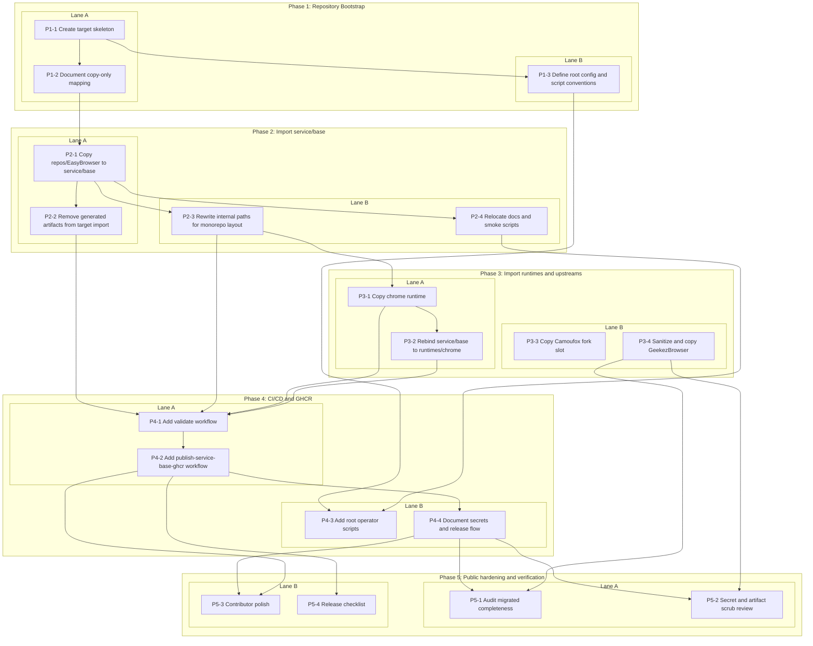

# Dependency Graph

```mermaid
graph TD
  subgraph Phase1["Phase 1: Repository Bootstrap"]
    subgraph P1LaneA["Lane A"]
      P11["P1-1 Create target skeleton"]
      P12["P1-2 Document copy-only mapping"]
    end
    subgraph P1LaneB["Lane B"]
      P13["P1-3 Define root config and script conventions"]
    end
    P11 --> P12
    P11 --> P13
  end

  subgraph Phase2["Phase 2: Import service/base"]
    subgraph P2LaneA["Lane A"]
      P21["P2-1 Copy repos/EasyBrowser to service/base"]
      P22["P2-2 Remove generated artifacts from target import"]
    end
    subgraph P2LaneB["Lane B"]
      P23["P2-3 Rewrite internal paths for monorepo layout"]
      P24["P2-4 Relocate docs and smoke scripts"]
    end
    P21 --> P22
    P21 --> P23
    P21 --> P24
  end

  subgraph Phase3["Phase 3: Import runtimes and upstreams"]
    subgraph P3LaneA["Lane A"]
      P31["P3-1 Copy chrome runtime"]
      P32["P3-2 Rebind service/base to runtimes/chrome"]
    end
    subgraph P3LaneB["Lane B"]
      P33["P3-3 Copy Camoufox fork slot"]
      P34["P3-4 Sanitize and copy GeekezBrowser"]
    end
    P31 --> P32
  end

  subgraph Phase4["Phase 4: CI/CD and GHCR"]
    subgraph P4LaneA["Lane A"]
      P41["P4-1 Add validate workflow"]
      P42["P4-2 Add publish-service-base-ghcr workflow"]
    end
    subgraph P4LaneB["Lane B"]
      P43["P4-3 Add root operator scripts"]
      P44["P4-4 Document secrets and release flow"]
    end
    P41 --> P42
    P42 --> P44
  end

  subgraph Phase5["Phase 5: Public hardening and verification"]
    subgraph P5LaneA["Lane A"]
      P51["P5-1 Audit migrated completeness"]
      P52["P5-2 Secret and artifact scrub review"]
    end
    subgraph P5LaneB["Lane B"]
      P53["P5-3 Contributor polish"]
      P54["P5-4 Release checklist"]
    end
  end

  P12 --> P21
  P13 --> P43
  P23 --> P31
  P24 --> P43
  P22 --> P41
  P23 --> P41
  P31 --> P41
  P32 --> P41
  P42 --> P54
  P44 --> P51
  P44 --> P52
  P44 --> P53
  P42 --> P53
  P34 --> P51
  P34 --> P52
```
